<h1 align="center">Hello..✌ I'm Ritesh Kumar Chauhan</h1>
<h3 align="center">Passionate about coding and exploring new things 😉🧐</h3>
 

🌱 Currently diving deeper into **DSA, Backend Development & System Design**

- 💼 Portfolio: **https://riteshkumarchauhan.vercel.app**
- 📫 How to reach me: **riteshkumarchauhan9@gmail.com**

<h3 align="left">Connect with me:</h3>

  &nbsp;&nbsp;
  &nbsp;&nbsp;
  

 
 
 

# 💻 Tech Stack:
#### Languages

#### Backend

#### Frontend

#### AI & ML

#### Databases

#### Web3

#### Tools

 
 
 

# 📊 GitHub Stats:

  
  &nbsp;&nbsp;&nbsp;&nbsp;&nbsp;&nbsp;&nbsp;&nbsp;&nbsp;
  

 
 

 
 
 

### ✍️ Random Dev Quote

 
 

<picture>
  <source media="(prefers-color-scheme: dark)" srcset="https://raw.githubusercontent.com/RiteshKrChauhan/RiteshKrChauhan/output/galaga-contribution-graph-dark.svg">
  <source media="(prefers-color-scheme: light)" srcset="https://raw.githubusercontent.com/RiteshKrChauhan/RiteshKrChauhan/output/galaga-contribution-graph.svg">
  
</picture>
